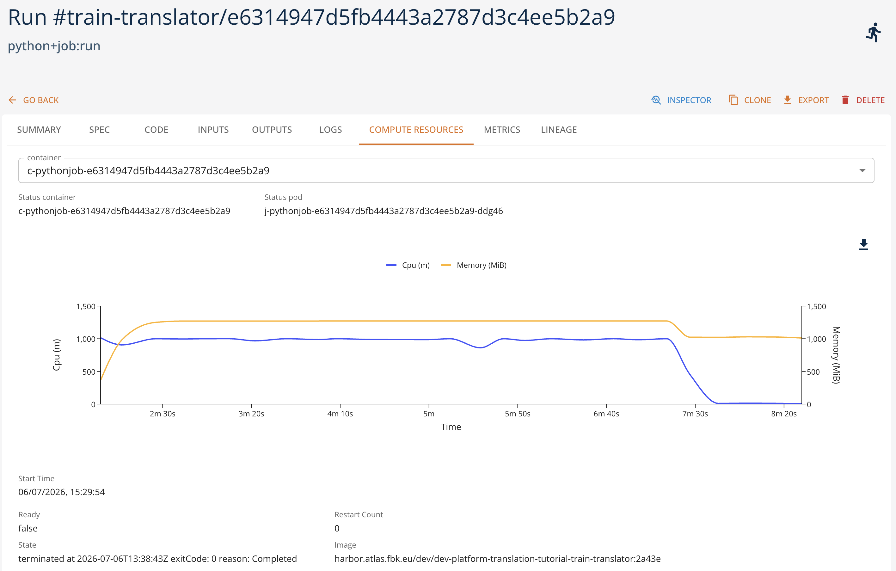
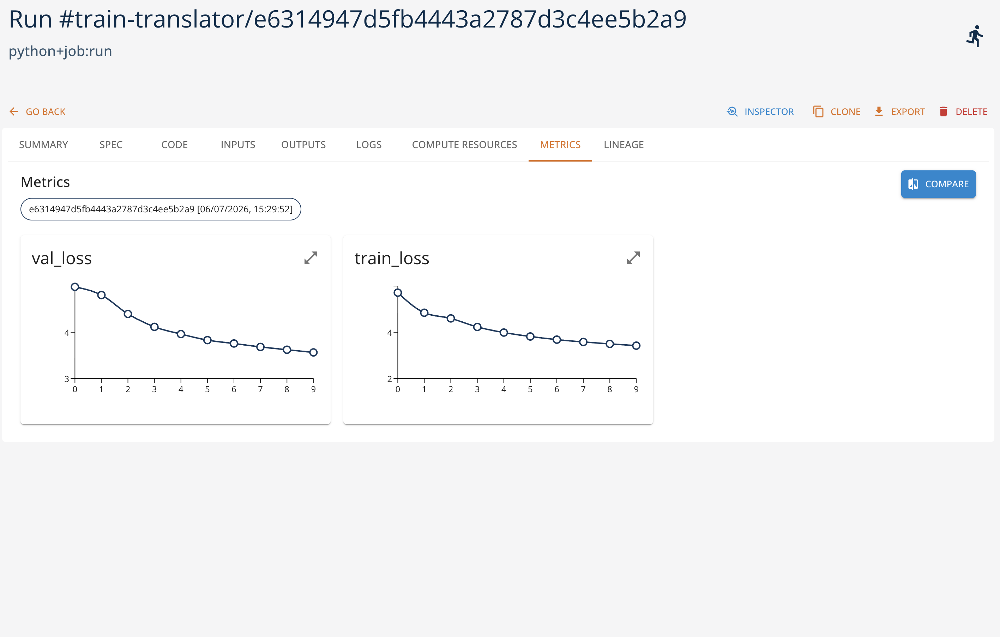

# Language Translation

This tutorial is based on the language translation example of the PyTorch [official examples set](https://github.com/pytorch/examples/tree/main/language_translation). This example shows how one might use transformers for language translation. In particular, this implementation is loosely based on the [Attention is All You Need paper](https://arxiv.org/abs/1706.03762).

## Overview

The tutorial demonstrates how to migrate an existing project to use the platform and its instruments. More specifically, the original project has the following important characteristics:

- the code is **structured in a set of files** that are imported in the main file.
- the main file may be **run from the command line** with a set of arguments that are then passed to the `main` function, which is the entry point of the implementation.
- the code requires some preparatory steps, which are **executed before the main script**, to download the language models.
- the training **data is static** and is imported using a specific library from the datasets available on a public GitHub repository.
- the training function relies on tourch library as well as some **additional python dependencies**.
- the function get use of **GPU acceleration** and may use CUDA libraries if available. 
- the training function **saves the model** to the local folder.

With this properties in mind, we show how to migrate the code to use the platform and its instruments in the best way possible:

- describe and register training procedure starting from the Git repository of the tutorial and adding a necessary wrapper for the training function as an entry point for the platform. In this way the changes to the original code are minimal.
- make the input data explicit and register it as a versioned data artifact in the platform to ensure the dataset is availble and may be reused.
- declaring and packaging the dependencies required for the code to be executed. 
- registering the trained model as a versioned model entity in the platform, together with the hyper parameters, metrics, and input data references to keep track of the lineage.
- track the experiment metrics in order to be able to evaluate the training performance and compare different experiments.

## 1. Preparatory Steps

But before doing the migration, we need to address several critical issues with the original code:

- the original scenario cannot be reproduced as the dependencies are not explicity defined and current versions are not compatible with each other.
- the dataset used by the original code refers to third-party data, while the original dataset used by the paper is not available anymore.
- the scenario in general allows for arbitrary SpaCy-compatible models, but in practice the dataset is for German to English translation only. The reference to the dataset is hardocded in the original code of the project.

To solve the compatibility issue, the `requirements.txt` has been changed to refer to explicit versions of the dependencies. 

To address the issue of the hardcoded dataset, we change the code so that the reference to the training and validation data may be customized (see `src/data.py` for reference):

```python
# Read a local tar.gz archive (Multi30k format) and return a list of (src, tgt) tuples.
# The archive must contain one file per language, identified by its extension (e.g. train.de / train.en).
def _read_local_tarfile(path, src_lang, tgt_lang):
    with tarfile.open(path, "r:gz") as tar:
        members = tar.getmembers()
        src_member = next(m for m in members if m.name.endswith(f".{src_lang}"))
        tgt_member = next(m for m in members if m.name.endswith(f".{tgt_lang}"))
        src_lines = tar.extractfile(src_member).read().decode("utf-8").splitlines()
        tgt_lines = tar.extractfile(tgt_member).read().decode("utf-8").splitlines()
    return list(zip(src_lines, tgt_lines))

...


    # Get training examples from torchtext (the multi30k dataset)
    train_file = getattr(opts, "train_file", None)
    valid_file = getattr(opts, "valid_file", None)

    if train_file is not None and valid_file is not None:
        train_iterator = _read_local_tarfile(train_file, src_lang, tgt_lang)
        valid_iterator = _read_local_tarfile(valid_file, src_lang, tgt_lang)
    else:
        multi30k.URL["train"] = "https://raw.githubusercontent.com/neychev/small_DL_repo/master/datasets/Multi30k/training.tar.gz"
        multi30k.URL["valid"] = "https://raw.githubusercontent.com/neychev/small_DL_repo/master/datasets/Multi30k/validation.tar.gz"
        train_iterator = Multi30k(split="train", language_pair=(src_lang, tgt_lang))
        valid_iterator = Multi30k(split="valid", language_pair=(src_lang, tgt_lang))
```

In this way the datasets are read from local files, falling back to predefined dataset if the files are not specified.

For the project to work, the language models should be downloaded and installed using SpaCy toolkit before the script execution. In certain settings it may be more
flexible to download and install the models programmatically, like this is done in the following project: [https://github.com/BramVanroy/spacy_download](https://github.com/BramVanroy/spacy_download). In this approach the CLI is called programmatically and the model is imported on the fly. While not strictly necessary, this approach
makes the code self-consistent and universal. We will see how this may be used in the migration steps. 

## 2. Adapting the Code

To make the code executed as a Python Job in the platform, we first need to define the entry point for the training function. This is done by adding a wrapper around the original `main` function in `src/main.py`. With this wrapper, we want to be able to make **explicit and tracked** the following information:

- the input hyper-parameters and their default values;
- initialization of the input data from the versioned artifacts registered in the platform;
- store the output model as a versioned artifact in the platform with its metrics, weights, and hyper-parameters.

Please note that the data initialization and storing the training output are mandatory steps for the migration as the execution of the code within the platform is based on ephemeral storage, which is empty at the beginning and will be destroyed at the end of the execution.

```python
import sys
import traceback
sys.path.append("./torch-translation-tutorial/")

# WORKAROUND for SpaCy language model download. To use SpaCy models,
# the model must be downloaded and installed before the training script. 
# TO make it dynamic, we call the spacy.cli.download() function to download the model 
# to a specific location, and then import it from that location.
def ensure_lang_model(model_name: str):
    from importlib import import_module
    from spacy.cli import download
    import spacy

    OLD_MODEL_SHORTCUTS = (
                        spacy.errors.OLD_MODEL_SHORTCUTS if hasattr(spacy.errors, "OLD_MODEL_SHORTCUTS") else {}
                    )
    
    model_name = OLD_MODEL_SHORTCUTS[model_name] if model_name in OLD_MODEL_SHORTCUTS else model_name
    download(model_name, False, False, None, "-t", "/shared/language_models/")    
    sys.path.append("/shared/language_models/")
    model_module = import_module(model_name)
    model_module.load()
    
from main import main
def train(
   project,
   run,
   training_data,
   validation_data,
   src_lang="de",
   tgt_lang="en",
   epochs=30,     
   lr=1e-4,
   batch_size=128,
   backend="cpu",
   attn_heads=8,
   enc_layers=5,
   dec_layers=5,
   embed_size=512,
   dim_feedforward=512,
   dropout=0.1,
   model_name="translator-model",
):
    print("Running training script...")
    opts = type("Namespace", (), {})()
    setattr(opts, "src", src_lang)
    setattr(opts, "tgt", tgt_lang)
    setattr(opts, "epochs", epochs)
    setattr(opts, "lr", lr)
    setattr(opts, "batch", batch_size)
    setattr(opts, "backend", backend)
    setattr(opts, "attn_heads", attn_heads)
    setattr(opts, "enc_layers", enc_layers)
    setattr(opts, "dec_layers", dec_layers)    
    setattr(opts, "embed_size", embed_size)
    setattr(opts, "dim_feedforward", dim_feedforward)
    setattr(opts, "dropout", dropout)
    
    model_dir = "./data/output/"
    # fixed logging dir
    setattr(opts, "logging_dir", model_dir)
    
    try:
        ensure_lang_model(src_lang)
        ensure_lang_model(tgt_lang)
    except Exception as e:
        print(f"Error downloading language models: {e}")
        print(traceback.format_exc())
        raise e

    training_data.download("./data/input/training.tar.gz", overwrite=True)
    validation_data.download("./data/input/validation.tar.gz", overwrite=True)
    setattr(opts, "train_file", "./data/input/training.tar.gz")
    setattr(opts, "valid_file", "./data/input/validation.tar.gz")

    setattr(opts, "dry_run", False)

    setattr(opts, "run", run)

    try:
        metrics = main(opts)
        print(f"Model metrics:{metrics}")
    except Exception as e:
        print(f"Error running training script: {e}")
        print(traceback.format_exc())
        raise e

    parameters = {
        "src": src_lang,
        "tgt": tgt_lang,
        "epochs": epochs,
        "lr": lr,
        "batch": batch_size,
        "backend": backend,
        "attn_heads": attn_heads,
        "enc_layers": enc_layers,
        "dec_layers": dec_layers,
        "embed_size": embed_size,
        "dim_feedforward": dim_feedforward,
        "dropout": dropout
    }

    # log model
    model_artifact = project.log_model(
        name=model_name,
        kind="model",
        framework="pytorch",
        source=model_dir + "best.pt",
        parameters=parameters,
    )
    model_artifact.log_metrics(metrics)

    return model_artifact
```

Let us see the implementation of the `wrapper` in details.

### Code references

```python
sys.path.append("./torch-translation-tutorial/")
```

This is needed to import the `main` function from the `src/main.py` file. When the Git tutorial project is imported, the execution has the project root as a python entry path. So to make the `main.py` and `src/` files visible, we need to add the tutorial root to the python path.

### Dynamic language model download

The `ensure_lang_model` function is used to download and make available the language models using SpaCy. The function is called by the `train` function and is used to download the language model to the shared folder.

Note, however, that this functionality is optional. Instead, one can add the spacy download instructions to the `build` operation of the training function. In this way the models will be downloaded and embedded in the container image before the training script is executed. This avoids the need to download the models at runtime, but restricts the training function to be applicable only to predefined languages.

### Function parameters declaration

To make the hyper parameters explicit, we need to declare the entry point taking them into account:

```python
def train(
   project,
   run,
   training_data,
   validation_data,
   src_lang="de",
   tgt_lang="en",
   epochs=30,     
   lr=1e-4,
   batch_size=128,
   backend="cpu",
   attn_heads=8,
   enc_layers=5,
   dec_layers=5,
   embed_size=512,
   dim_feedforward=512,
   dropout=0.1,
   model_name="translator-model",
):
    ...
```

Note some extra parameters passed:

- `project` (optional) - the project object that will be embedded by the platform SDK to simplify the access to the project artifacts;
- `run` (optional) - the run object that will be embedded by the platform SDK to simplify the run-specific operations, such that training performance metrics logging;
- `training_data` - the reference to the training data artifact within the project
- `validation_data` - the reference to the validation data artifact within the project
- `model_name` - the name of the model to be trained and stored as a versioned artifact in the platform.

### Input data preparation

```python
    training_data.download("./data/input/training.tar.gz", overwrite=True)
    validation_data.download("./data/input/validation.tar.gz", overwrite=True)
    setattr(opts, "train_file", "./data/input/training.tar.gz")
    setattr(opts, "valid_file", "./data/input/validation.tar.gz")
```

The input data is downloaded from the platform and extracted to the local folder. Note how the input data is treated: Python SDK of the platform treats the referenced objects as platform artifacts so the corresponding methods may be used (`download` method to store the artifact locally). The `opts` object is used to pass the file names to the training function.

### Output model logging

Once training is complete, the output model is stored in the platform and logged as a versioned artifact. The model metrics and hyper parameters are stored as well.

```python
parameters = {
        "src": src_lang,
        "tgt": tgt_lang,
        "epochs": epochs,
        "lr": lr,
        "batch": batch_size,
        "backend": backend,
        "attn_heads": attn_heads,
        "enc_layers": enc_layers,
        "dec_layers": dec_layers,
        "embed_size": embed_size,
        "dim_feedforward": dim_feedforward,
        "dropout": dropout
    }

    # log model
    model_artifact = project.log_model(
        name=model_name,
        kind="model",
        framework="pytorch",
        source=model_dir + "best.pt",
        parameters=parameters,
    )
    model_artifact.log_metrics(metrics)

    return model_artifact
```

### (Optional) Obtaining the model metrics

This is a (optional) change to be done in `main.py` file in order to get the model metrics to log. Since our wrapping code is executed outside of the main training function, to be able to log the metrics for the generated model we need to return the metrics from training:

```python
def main(opts):
    ...
    return {
        "train_loss": train_loss,
        "val_loss": val_loss,
    }    
```

### (Optional) Tracing the training metrics

The last (optional also in this) change regards the possibility to report the training metrics while executing at each epoch step. This is done by the following code:

```python 
    ...
    run = opts.run if hasattr(opts, "run") else None
    ...

    if run is not None:
        metrics = {"train_loss": train_loss, "val_loss": val_loss}
        logging.info(f"Logging metrics to run... : {metrics}")
        run.log_metrics(metrics)
```

This is why we need `run` parameter to our entry point. Otherwise it should be reconstructed using SDK from the `RUN_ID` environment variable available in the container.

## 3. Performing training procedure within the platform

Once the code is ready, we can execute it in the platform. As all the operations of the platform, we start from defining the context of our experiments and executions, or **project**. Project is a logical container for data, artifacts, models, executable operations, and their executions.

### Define the context

It is possible to create the project via platform UI or programmatically using the platform SDK:

```python

import digitalhub as dh

project = dh.get_or_create_project("translation-example")
```

### Prepare and register the input data
The next step is to prepare and explicitly register the input data necessary for our experiment. Making it explicit allows for better tracability and reproducibility of the experiments. We will use the same data as in the original code. Download it locally for further processing.

- training: [https://raw.githubusercontent.com/neychev/small_DL_repo/master/datasets/Multi30k/training.tar.gz](https://raw.githubusercontent.com/neychev/small_DL_repo/master/datasets/Multi30k/training.tar.gz)
- validation: [https://raw.githubusercontent.com/neychev/small_DL_repo/master/datasets/Multi30k/validation.tar.gz](https://raw.githubusercontent.com/neychev/small_DL_repo/master/datasets/Multi30k/validation.tar.gz)

It is possible to upload the data artifacts via UI or programmatically:

```python

project.log_artifact("train-data", kind="artifact", source="training.tar.gz")
project.log_artifact("validation-data", kind="artifact", source="validation.tar.gz")
```

### Register function

Next, we need to describe and register our training function. Our code is pure Python Job application, so we can use `python` runtime for this purpose. Again, it is possible to do it via UI or programmatically:

```python
func = project.new_function(
    "train-translator",
    kind="python",
    python_version="PYTHON3_12",
    code_src="git+https://github.com/scc-digitalhub/digitalhub-tutorials",
    handler="torch-translation-tutorial.wrapper:train",
    requirements=["torch==2.3.0", "torchtext==0.18.0", "torchdata==0.9.0", "spacy===3.8.14", "portalocker==3.2.0", "click >= 8.2.1"]
)
```

Note the reference to the git repository where the training function is located: by default it will point out to the **current** version of the code in the main branch. So each time the function is executed, the latest version of the code will be used. However, it is possible to point to a specific commit, branch, or tag using the standard git reference syntax (e.g., `git+https://github.com/scc-digitalhub/digitalhub-tutorials#main`).

If the code is at the private repository, it is possile to [configure the credentials](https://scc-digitalhub.github.io/docs/tasks/code-source/#remote-git-repository) to access it, using environment variables or [secrets](https://scc-digitalhub.github.io/docs/tasks/secrets/), such as, e.g, `GITHUB_TOKEN`. 

The entry point is defined as `handler` attribute composed of python path to the containing module and the function name.

The dependencies are listed explicitly with their versions.

The python runtime allows for executing the code either `locally` or `remotely` (controlled by local_execution=True/False when `function.run` method is called).  Local execution means the code will be downloaded and executed in the same space where SDK is being called. This may be your PC or an interactive workspace like Jupyter notebook. Provided the dependencies are already installed (and GPU is available if necessary), the SDK will download the repo and call the function directly. This may work for testing purposes, but may be not practical for heavy and long-running tasks. In this case we should use remote execution.

In case of remote execution, the execution takes place in the computational cluster behind the platform. The SDK will call the platform API to trigger this execution, and the plaform will instantiate a **Kubernetes Job**, that will be scheduled on the cluster and will download the code and execute it with the parameters and configuration specified. For this to happen the underlying function container image should be created.

### Building a container image

The build operation may be triggered by the UI or programmatically:

```python

func.run(action="build")
```

This will result in the container image being created within the platform cluster, the image will be published in the internal image registry, and the function will be associated with the image. If the list of the dependencies changes, the container image should be rebuild. The images with the same dependencies and base image may be reused across different functions and executions.

If the build operation is not performed, the execution will fail as the base container image does not include the required dependencies.

Please note that it is possible to add further functionality to the container image passing additional build instructions (e.g., to download and pre-install the language models).

### Executing the function

The function can be executed via UI or programmatically:

```python
run = func.run(
    action="job",
    inputs={
        "training_data": project.get_artifact("train-data").key,
        "validation_data": project.get_artifact("validation-data").key
    },
    parameters={
        "epochs": 1,
        "backend": "gpu"
    },
    profile="1xV100",
    local_execution=False
)
```

In this example the function is executed remotely (`local_execution=False`). Note that

- hyper parameters are passed as `parameters` dictionary;
- input data entities are passed as `inputs` dictionary using the artifact keys as values (sort of unique artifact identifiers);
- the function is executed on the cluster with the specified hardware profile (e.g., "1xV100" - 1 node with 1 V100 GPU). The list of profiles depend on the cluster configuration of the platform. Indeed, when the function is executed locally, the profile parameter is ignored.

When the function is executed, the resource and custom metrics are collected:

[]
[]

Once the execution terminates successfully, the resulting model is logged and registered in the platform as a versioned artifact ready for inference use.

## 4. Using the Model for Inference

Once model is trained, we can test it for inference. We start from downloading the model weights locally and create the inference from them.

```python
model = project.get_model("translator-model")
model.download("./model/", overwrite=True)
```

Once the model is downloaded, we can use it for inference. First, we initialize the model

```python
from src.model import Translator # Our model
from src.data import get_data, create_mask, generate_square_subsequent_mask # Loading data and data preprocessing

import torch 

DEVICE = torch.device("cuda" if torch.cuda.is_available() else "cpu")

opts = type("Namespace", (), {})()
setattr(opts, "src", model.spec.parameters['src'])
setattr(opts, "tgt", model.spec.parameters['tgt'])
setattr(opts, "batch", model.spec.parameters['batch'])
setattr(opts, "train_file", "training.tar.gz")
setattr(opts, "valid_file", "validation.tar.gz")

_, _, src_vocab, tgt_vocab, src_transform, _, special_symbols = get_data(opts)

src_vocab_size = len(src_vocab)
tgt_vocab_size = len(tgt_vocab)

# Create model
translator = Translator(
    num_encoder_layers=model.spec.parameters['enc_layers'],
    num_decoder_layers=model.spec.parameters['dec_layers'],
    embed_size=model.spec.parameters['embed_size'],
    num_heads=model.spec.parameters['attn_heads'],
    src_vocab_size=src_vocab_size,
    tgt_vocab_size=tgt_vocab_size,
    dim_feedforward=model.spec.parameters['dim_feedforward'],
    dropout=model.spec.parameters['dropout']
).to(DEVICE)

# Load in weights
translator.load_state_dict(torch.load("./model/best.pt"))

# Set to inference
translator.eval()
```

Second, we try the inference with a test sentence.  

```python
sentence = "Ich verstehe nicht."

def greedy_decode(model, src, src_mask, max_len, start_symbol, end_symbol):

    # Move to device
    src = src.to(DEVICE)
    src_mask = src_mask.to(DEVICE)

    # Encode input
    memory = model.encode(src, src_mask)

    # Output will be stored here
    ys = torch.ones(1, 1).fill_(start_symbol).type(torch.long).to(DEVICE)

    # For each element in our translation (which could range up to the maximum translation length)
    for _ in range(max_len-1):

        # Decode the encoded representation of the input
        memory = memory.to(DEVICE)
        tgt_mask = (generate_square_subsequent_mask(ys.size(0), DEVICE).type(torch.bool)).to(DEVICE)
        out = model.decode(ys, memory, tgt_mask)

        # Reshape
        out = out.transpose(0, 1)

        # Covert to probabilities and take the max of these probabilities
        prob = model.ff(out[:, -1])
        _, next_word = torch.max(prob, dim=1)
        next_word = next_word.item()

        # Now we have an output which is the vector representation of the translation
        ys = torch.cat([ys, torch.ones(1, 1).type_as(src.data).fill_(next_word)], dim=0)
        if next_word == end_symbol:
            break

    return ys


# Convert to tokens
src = src_transform(sentence).view(-1, 1)
num_tokens = src.shape[0]

src_mask = (torch.zeros(num_tokens, num_tokens)).type(torch.bool)

# Decode
tgt_tokens = greedy_decode(
    translator, src, src_mask, max_len=num_tokens+5, start_symbol=special_symbols["<bos>"], end_symbol=special_symbols["<eos>"]
).flatten()

# Convert to list of tokens
output_as_list = list(tgt_tokens.cpu().numpy())

# Convert tokens to words
output_list_words = tgt_vocab.lookup_tokens(output_as_list)

# Remove special tokens and convert to string
translation = " ".join(output_list_words).replace("<bos>", "").replace("<eos>", "")

print(translation)
```